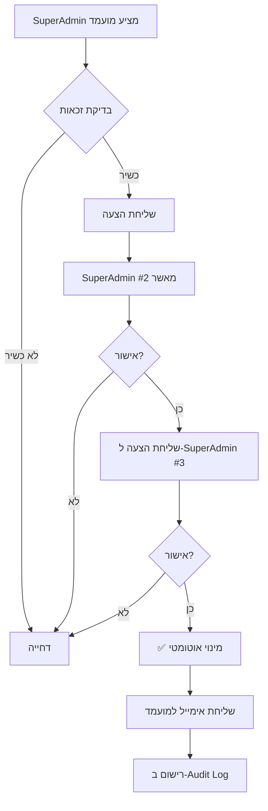

# 🛡️ מערכת הרשאות ואישורים - אפליקציית קיצור

## 📋 תוכן עניינים
1. [סקירה כללית](#overview)
2. [היררכיית תפקידים](#roles)
3. [מערכת אישורים](#approvals)
4. [SuperAdmin Management](#superadmin)
5. [Security Implementation](#security)
6. [Audit Log](#audit)

---

<a name="overview"></a>
## 🎯 1. סקירה כללית

### למה צריך מערכת הרשאות מתקדמת?

**אפליקציה הלכתית = אחריות רבה**
- תשובות שגויות יכולות להוביל לפסיקות הלכתיות לא נכונות
- צריך להבטיח **אמינות מוחלטת** של כל תשובה
- רק אנשי הלכה מוסמכים יכולים לתת תשובות
- כל תשובה חייבת **5+ אישורים** לפני פרסום

### עקרונות יסוד:
1. ✅ **Trust by Verification** - אמון דרך אימות
2. ✅ **Multiple Approvals** - אישור מרובה חובה
3. ✅ **Audit Everything** - תיעוד מלא של כל פעולה
4. ✅ **Hierarchical Permissions** - הרשאות מדורגות
5. ✅ **Immutable History** - היסטוריה שלא ניתן לשנות

---

<a name="roles"></a>
## 👥 2. היררכיית תפקידים (7 רמות)

### רמה 0: Anonymous (אנונימי)
**תיאור:** משתמש לא מזוהה (Device ID בלבד)

**הרשאות:**
- ✅ שאילת שאלות
- ✅ צפייה בתשובות מאושרות
- ❌ דירוג תשובות
- ❌ אישור תשובות
- ❌ מתן תשובות

**משקל אישור:** 0

**דוגמה:**  
משתמש ראשון שמוריד את האפליקציה ושואל: "מה הברכה על תפוח?"

---

### רמה 1: Registered (משתמש רשום)
**תיאור:** משתמש שנרשם עם אימייל + סיסמה

**הרשאות:**
- ✅ כל ההרשאות של Anonymous
- ✅ דירוג תשובות (👍/👎)
- ✅ שמירת שאלות מועדפות
- ❌ אישור תשובות
- ❌ מתן תשובות

**משקל אישור:** 1

**איך להשיג:**  
הרשמה באפליקציה (אימייל + סיסמה או Google Sign-In)

---

### רמה 2: Trusted (משתמש אמין)
**תיאור:** משתמש רשום שהוכיח אמינות (10+ דירוגים מדויקים)

**הרשאות:**
- ✅ כל ההרשאות של Registered
- ✅ **אישור תשובות** (עם משקל נמוך)
- ❌ מתן תשובות
- ❌ עריכת תשובות

**משקל אישור:** 5

**איך להשיג:**  
אוטומטי לאחר 10 דירוגים שהתאמו לקונצנזוס הקהילה

**דוגמה:**  
משה משתמש באפליקציה חצי שנה, דירג 20 תשובות, רובן במדויק → הועלה ל-Trusted

---

### רמה 3: Scholar (תלמיד חכם)
**תיאור:** בעל ידע הלכתי מוכח (לומד בכולל/ישיבה)

**הרשאות:**
- ✅ כל ההרשאות של Trusted
- ✅ **מתן תשובות** (עם ציון מקורות חובה)
- ✅ אישור תשובות עם משקל גבוה
- ❌ עריכת תשובות של אחרים
- ❌ מחיקת תוכן

**משקל אישור:** 10

**איך להשיג:**  
1. בקשה למנהל (Moderator/SuperAdmin)
2. צירוף מסמכים: אישור רב התחום, המלצה מראש ישיבה
3. בדיקת תשובות לדוגמה (3 תשובות לשאלות מורכבות)
4. אישור מנהל

**דוגמה:**  
אברך בכולל שלומד הלכה באופן שוטף, מספק המלצה מהרב ראש הכולל

---

### רמה 4: Rabbi (רב מוסמך)
**תיאור:** בעל סמיכה רבנית מוכרת

**הרשאות:**
- ✅ כל ההרשאות של Scholar
- ✅ אישור תשובות עם **משקל מאוד גבוה**
- ✅ צפייה בסטטיסטיקות
- ✅ תגיות "רב מוסמך" בתשובות
- ❌ עריכת תשובות של אחרים
- ❌ ניהול משתמשים

**משקל אישור:** 50

**איך להשיג:**
1. בקשה ל-SuperAdmin
2. צירוף תעודת סמיכה (PDF)
3. אימות זהות (שיחת וידאו)
4. אישור SuperAdmin

**דוגמה:**  
רב קהילה עם סמיכה מהרבנות הראשית, רוצה לתרום לקהילה

---

### רמה 5: Moderator (מנהל)
**תיאור:** מנהל תוכן ומשתמשים

**הרשאות:**
- ✅ כל ההרשאות של Rabbi
- ✅ **עריכת תשובות** (עם תיעוד מלא)
- ✅ **מחיקת תוכן** לא הולם
- ✅ **ניהול משתמשים** (העלאת רמות עד Rabbi)
- ✅ צפייה ב-Audit Log
- ❌ מתן הרשאות SuperAdmin

**משקל אישור:** 25

**איך להשיג:**  
מינוי על ידי SuperAdmin (בדרך כלל רבנים מנוסים)

**דוגמה:**  
רב ותיק שעובד עם האפליקציה שנה, מוכיח אחריות ושיפוט טוב

---

### רמה 6: SuperAdmin (מנהל על)
**תיאור:** הבעלים והמייסדים - שליטה מלאה

**הרשאות:**
- ✅ **כל ההרשאות ללא יוצא מן הכלל**
- ✅ **העלאת משתמשים ל-SuperAdmin**
- ✅ מחיקת מנהלים אחרים
- ✅ גישה לכל הנתונים
- ✅ שינוי הגדרות מערכת
- ✅ ניהול Firebase Console

**משקל אישור:** 100

**איך להשיג:**  
- אין בקשה - רק מינוי ידני
- בדרך כלל: מייסדי האפליקציה
- צריך 2 SuperAdmins קיימים לאשר SuperAdmin חדש

**דוגמה:**  
מייסד האפליקציה, רב ראשי שותף

---

<a name="approvals"></a>
## ✅ 3. מערכת אישורים (Minimum 5 Approvals)

### חוק הברזל: **5 אישורים מינימום**

כל תשובה חייבת לעבור:
1. ✅ לפחות **5 אישורים** ממשתמשים שונים
2. ✅ או **סכום משקל אישורים ≥ 100**

### דוגמאות:

#### תרחיש 1: אישור רב אחד
- רב (משקל 50) ✅
- רב (משקל 50) ✅
- **סה"כ: 100** → ✅ מאושר!

#### תרחיש 2: אישור קהילתי
- Trusted (משקל 5) ✅
- Trusted (משקל 5) ✅
- Scholar (משקל 10) ✅
- Scholar (משקל 10) ✅
- Scholar (משקל 10) ✅
- Trusted (משקל 5) ✅
- **6 אישורים, סה"כ: 45** → ⏳ עדיין ממתין (צריך עוד)

#### תרחיש 3: SuperAdmin Override
- SuperAdmin (משקל 100) ✅
- **סה"כ: 100** → ✅ מאושר מיד!

### קוד לבדיקה:

```typescript
function isAnswerApproved(answer: Answer): boolean {
  const totalWeight = answer.approvals.reduce((sum, approval) => {
    return sum + approval.weight;
  }, 0);
  
  const count = answer.approvals.length;
  
  // צריך לפחות 5 אישורים OR משקל 100+
  return count >= 5 || totalWeight >= 100;
}
```

### UI להצגת סטטוס אישור:

```typescript
function ApprovalBadge({ answer }: { answer: Answer }) {
  const totalWeight = answer.totalApprovalWeight;
  const count = answer.approvals.length;
  const progress = Math.min((totalWeight / 100) * 100, 100);
  
  return (
    <View>
      <ProgressBar value={progress} max={100} />
      <Text>
        {count}/5 אישורים | משקל: {totalWeight}/100
      </Text>
      {progress >= 100 && <Badge>✅ מאושר</Badge>}
    </View>
  );
}
```

---

<a name="superadmin"></a>
## 👑 4. SuperAdmin Management

### תהליך מינוי SuperAdmin חדש:



### קוד למינוי SuperAdmin:

```typescript
async function nominateSuperAdmin(
  nominator: string,    // SuperAdmin מנמק
  candidate: string,    // מועמד
  reason: string
): Promise<void> {
  // 1. בדיקה שהמנמק הוא SuperAdmin
  const nominatorProfile = await getUserProfile(nominator);
  if (nominatorProfile?.role !== 'superadmin') {
    throw new Error('רק SuperAdmin יכול להציע מועמדים');
  }
  
  // 2. בדיקה שהמועמד כשיר (רב מוסמך לפחות)
  const candidateProfile = await getUserProfile(candidate);
  if (!candidateProfile || !['rabbi', 'moderator'].includes(candidateProfile.role)) {
    throw new Error('מועמד חייב להיות לפחות רב מוסמך');
  }
  
  // 3. יצירת הצעה
  const nomination = {
    id: `nomination_${Date.now()}`,
    candidate,
    candidateName: candidateProfile.displayName,
    nominatedBy: nominator,
    reason,
    timestamp: Date.now(),
    approvals: [nominator], // מנמק אוטומטית מאשר
    status: 'pending'
  };
  
  // 4. שמירה
  await saveNomination(nomination);
  
  // 5. שליחת התראה לכל ה-SuperAdmins
  const allSuperAdmins = await getUsersByRole('superadmin');
  await sendNotifications(allSuperAdmins, nomination);
}

async function approveSuperAdminNomination(
  nominationId: string,
  approverId: string
): Promise<void> {
  const nomination = await getNomination(nominationId);
  
  // הוסף אישור
  nomination.approvals.push(approverId);
  
  // צריך 3 SuperAdmins לאשר (כולל המנמק)
  if (nomination.approvals.length >= 3) {
    // מינוי!
    await grantRole('system', nomination.candidate, 'superadmin', nomination.reason);
    nomination.status = 'approved';
    
    console.log(`🎉 SuperAdmin חדש: ${nomination.candidateName}`);
  }
  
  await updateNomination(nomination);
}
```

---

<a name="security"></a>
## 🔒 5. Security Implementation

### Custom Claims (Firebase Auth)

**הגדרה ב-Cloud Function:**

```typescript
// functions/src/auth.ts
import * as functions from 'firebase-functions';
import * as admin from 'firebase-admin';

export const setUserClaims = functions.https.onCall(async (data, context) => {
  // בדיקה שהמבקש הוא SuperAdmin
  const callerUid = context.auth?.uid;
  const callerClaims = context.auth?.token;
  
  if (!callerClaims?.role === 'superadmin') {
    throw new functions.https.HttpsError(
      'permission-denied',
      'רק SuperAdmin יכול לשנות הרשאות'
    );
  }
  
  const { userId, role, approvalLevel } = data;
  
  // הגדרת Custom Claims
  await admin.auth().setCustomUserClaims(userId, {
    role,
    approvalLevel,
    canApproveAnswers: ROLE_PERMISSIONS[role].canApproveAnswers,
    canEditAnswers: ROLE_PERMISSIONS[role].canEditAnswers,
    canManageUsers: ROLE_PERMISSIONS[role].canManageUsers
  });
  
  // עדכון פרופיל ב-Firestore
  await admin.firestore()
    .collection('users')
    .doc(userId)
    .update({
      role,
      approvalLevel,
      updatedAt: admin.firestore.FieldValue.serverTimestamp()
    });
  
  return { success: true };
});
```

**שימוש בצד הלקוח:**

```typescript
// utils/auth.ts
export async function getUserClaims(): Promise<UserPermissions> {
  const user = await getCurrentUser();
  if (!user) return ROLE_PERMISSIONS.anonymous;
  
  const tokenResult = await user.getIdTokenResult();
  const claims = tokenResult.claims;
  
  return {
    canAskQuestions: true,
    canAnswerQuestions: claims.canAnswerQuestions || false,
    canApproveAnswers: claims.canApproveAnswers || false,
    canEditAnswers: claims.canEditAnswers || false,
    canDeleteContent: claims.canDeleteContent || false,
    canManageUsers: claims.canManageUsers || false,
    canGrantSuperAdmin: claims.role === 'superadmin',
    canViewAnalytics: claims.canViewAnalytics || false,
    approvalWeight: ROLE_PERMISSIONS[claims.role]?.approvalWeight || 0
  };
}
```

---

<a name="audit"></a>
## 📝 6. Audit Log (יומן ביקורת)

### כל פעולה רגישה נרשמת:

```typescript
interface AuditLog {
  id: string;
  action: 'create' | 'edit' | 'delete' | 'approve' | 'reject' | 'role_change';
  performedBy: string;
  performedByName: string;
  performedByRole: UserRole;
  targetType: 'question' | 'answer' | 'user';
  targetId: string;
  timestamp: number;
  changes?: Record<string, any>;
  reason?: string;
}
```

### דוגמאות:

#### עריכת תשובה:
```json
{
  "id": "audit_123456",
  "action": "edit",
  "performedBy": "user_abc",
  "performedByName": "הרב דוד כהן",
  "performedByRole": "moderator",
  "targetType": "answer",
  "targetId": "ans_xyz",
  "timestamp": 1738761234567,
  "changes": {
    "previousText": "...טקסט ישן...",
    "newText": "...טקסט חדש...",
    "field": "text"
  },
  "reason": "תיקון שגיאת כתיב במקור הלכתי"
}
```

#### שינוי תפקיד:
```json
{
  "id": "audit_234567",
  "action": "role_change",
  "performedBy": "superadmin_1",
  "performedByName": "הרב משה לוי",
  "performedByRole": "superadmin",
  "targetType": "user",
  "targetId": "user_def",
  "timestamp": 1738761234567,
  "changes": {
    "previousRole": "scholar",
    "newRole": "rabbi",
    "grantedBy": "superadmin_1"
  },
  "reason": "קיבל סמיכה מהרבנות הראשית"
}
```

### קריאת Audit Log (רק מנהלים):

```typescript
async function getAuditLog(
  filters: {
    targetId?: string;
    performedBy?: string;
    action?: string;
    fromDate?: number;
    toDate?: number;
  },
  limit: number = 100
): Promise<AuditLog[]> {
  // בדיקת הרשאות
  const canView = await hasPermission(currentUserId, 'canViewAnalytics');
  if (!canView) {
    throw new Error('אין הרשאה לצפות ב-Audit Log');
  }
  
  let query = collection(db, 'auditLog');
  
  if (filters.targetId) {
    query = query.where('targetId', '==', filters.targetId);
  }
  
  if (filters.performedBy) {
    query = query.where('performedBy', '==', filters.performedBy);
  }
  
  // ... שאר הפילטרים
  
  const logs = await getDocs(query.limit(limit));
  return logs.docs.map(doc => doc.data() as AuditLog);
}
```

---

## 🎯 סיכום - Decision Matrix

| פעולה | Anonymous | Registered | Trusted | Scholar | Rabbi | Moderator | SuperAdmin |
|-------|-----------|------------|---------|---------|-------|-----------|------------|
| שאילת שאלות | ✅ | ✅ | ✅ | ✅ | ✅ | ✅ | ✅ |
| דירוג תשובות | ❌ | ✅ | ✅ | ✅ | ✅ | ✅ | ✅ |
| אישור תשובות | ❌ | ❌ | ✅ (משקל 5) | ✅ (משקל 10) | ✅ (משקל 50) | ✅ (משקל 25) | ✅ (משקל 100) |
| מתן תשובות | ❌ | ❌ | ❌ | ✅ | ✅ | ✅ | ✅ |
| עריכת תשובות | ❌ | ❌ | ❌ | ❌ | ❌ | ✅ | ✅ |
| מחיקת תוכן | ❌ | ❌ | ❌ | ❌ | ❌ | ✅ | ✅ |
| ניהול משתמשים | ❌ | ❌ | ❌ | ❌ | ❌ | ✅ | ✅ |
| מינוי SuperAdmin | ❌ | ❌ | ❌ | ❌ | ❌ | ❌ | ✅ |

---

## 📞 יצירת קשר

**שאלות על מערכת ההרשאות?**  
פנה ל-SuperAdmin דרך: admin@kitzur-app.com

**רוצה להפוך ל-Scholar/Rabbi?**  
מלא טופס בקשה באפליקציה → הגדרות → "בקש שדרוג"
